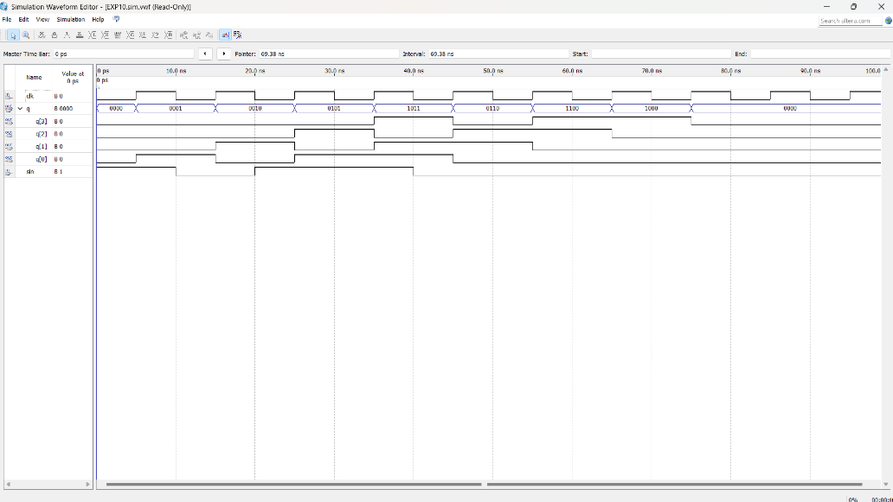

# SERIAL-IN-SERIAL-OUT-SHIFTREGISTER

**AIM:**

To implement  SISO Shift Register using verilog and validating their functionality using their functional tables

**SOFTWARE REQUIRED:**

Quartus prime

**THEORY**

**SISO shift Register**

A Serial-In Serial-Out shift register is a sequential logic circuit that allows data to be shifted in and out one bit at a time in a serial manner. It consists of a cascade of flip-flops connected in series, forming a chain. The input data is applied to the first flip-flop in the chain, and as the clock pulses, the data propagates through the flip-flops, ultimately appearing at the output.

The logic circuit provided below demonstrates a serial-in serial-out (SISO) shift register. It comprises four D flip-flops that are interconnected in a sequential manner. These flip-flops operate synchronously with one another, as they all receive the same clock signal.


Figure 01 4 Bit SISO Register

The synchronous nature of the flip-flops ensures that the shifting of data occurs in a coordinated manner. When the clock signal rises, the input data is sampled and stored in the first flip-flop. On subsequent clock pulses, the stored data propagates through the flip-flops, moving from one flip-flop to the next.
Each D flip-flop in the circuit has a Data (D) input, a Clock (CLK) input, and an output (Q). The D input represents the data to be loaded into the flip-flop, while the CLK input is connected to the common clock signal. The output (Q) of each flip-flop is connected to the D input of the next flip-flop, forming a cascade.

**Procedure**

1.Initialize the shift register to a known state (e.g., all zeros). 
2.Input a bit serially into the shift register. 
3.Shift the contents of the register one position to the right (or left). 
4.Output the shifted bit from the last stage of the register. 
5.Repeat steps 2-4 for each bit you want to input and shift.

**PROGRAM**

/* Program for flipflops and verify its truth table in quartus using Verilog programming.

Developed by: Jayasree R RegisterNumber: 212223230087

*/

```
module EXP10(clk, sin, q);
input clk;
input sin;
output [3:0] q;
reg [3:0] q;
always @(posedge clk)
begin
q[0] <= sin;
q[1] <= q[0];
q[2] <= q[1];
q[3] <= q[2];
end
endmodule

```

**RTL LOGIC FOR SISO Shift Register**


**TIMING DIGRAMS FOR SISO Shift Register**



**RESULTS**

SISO Shift Register using verilog and validating their functionality using their functional tables has successful execution of the program.
